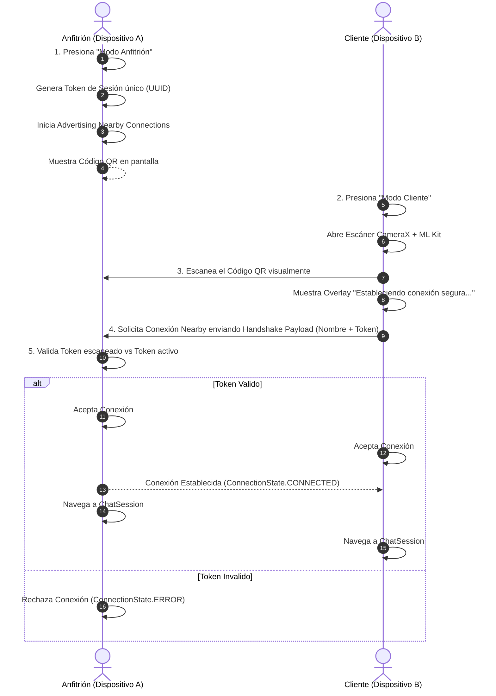

# ⚡ QuickPavlo - 100% Offline P2P Chat & Resumable File Transfer

[](https://developer.android.com/)
[](https://kotlinlang.org/)
[](https://developer.android.com/jetpack/compose)
[](https://developer.android.com/topic/architecture)
[](LICENSE)

**QuickPavlo** es una solución de comunicación punto a punto (P2P) y transferencia de archivos **100% Offline** para Android. Utiliza **Google Nearby Connections API** (sobre Wi-Fi Direct y Bluetooth) para crear redes locales ad-hoc sin necesidad de conexión a Internet, infraestructura centralizada ni servidores en la nube.

Su mecanismo de seguridad **Out-of-band (OOB)** combina autenticación visual mediante códigos QR dinámicos creados en tiempo real con **CameraX + ML Kit**, e incluye una innovadora arquitectura de **reanudación de transferencias de archivos por desplazamiento de bytes (offsets)** respaldada por persistencia local en **Room**.

---

## 🛠️ Arquitectura y Stack Tecnológico

La aplicación está diseñada bajo **Clean Architecture** estructurada en capas desacopladas (**UI**, **Domain** y **Data**) y el patrón de diseño **MVVM**, aprovechando las mejores prácticas recomendadas por Google.

```
┌─────────────────────────────────────────────────────────┐
│                       UI LAYER                          │
│   Jetpack Compose (M3)  │   ViewModels   │   NavHost    │
└────────────────────────────┬────────────────────────────┘
                             │
┌────────────────────────────▼────────────────────────────┐
│                     DOMAIN LAYER                        │
│   Use Cases   │   Models   │   Repository Interfaces    │
└────────────────────────────┬────────────────────────────┘
                             │
┌────────────────────────────▼────────────────────────────┐
│                      DATA LAYER                         │
│  NearbyP2PConnectionManagerImpl  │  Room DB  │  Prefs   │
└─────────────────────────────────────────────────────────┘
```

### 📱 Tech Stack

* **Lenguaje:** Kotlin 2.0
* **UI Toolkit:** Jetpack Compose con Material Design 3
* **Inyección de Dependencias:** Dagger Hilt
* **Navegación:** Jetpack Navigation Compose
* **Conectividad P2P Offline:** Google Play Services Nearby Connections (`P2P_POINT_TO_POINT`)
* **Escaneo y Cámara:** CameraX + Google ML Kit Barcode Scanning
* **Generación de QR:** ZXing Core
* **Base de Datos Local:** Room Persistence Library (Room KTX + KSP)
* **Concurrencia:** Kotlin Coroutines & Reactive `StateFlow` / `SharedFlow`
* **Gestión de Archivos:** Scoped Storage (API 29+ `MediaStore.Downloads/QuickPavlo`) + `FileProvider`

---

## 🔄 Flujo de Usuario y Conexión



### Pasos de Conexión:
1. **Dispositivo Anfitrión:** Toca "Modo Anfitrión". Se genera una clave temporal fuera de banda (OOB) combinada con el ID permanente del dispositivo y se despliega como un código QR dinámico mientras la antena entra en modo `ADVERTISING`.
2. **Dispositivo Cliente:** Toca "Modo Cliente". La cámara analiza los fotogramas en tiempo real usando **ML Kit Barcode Scanning**. Al detectar el código QR, activa inmediatamente la pantalla de carga (*"Estableciendo conexión segura..."*) y emite una solicitud `DISCOVERING` al Anfitrión adjuntando la clave de seguridad.
3. **Validación y Transición:** El Anfitrión verifica que el Token recibido coincida exactamente con el código QR mostrado. Tras el apretón de manos (*Handshake*), la antena de descubrimiento se apaga para ahorrar energía y ambas aplicaciones navegan automáticamente a la sala de **Chat P2P**.

---

## 🔥 Explicación Profunda de las "Killer Features"

### 1. Autenticación Fuera de Banda (OOB QR Handshake)
Para prevenir ataques de hombre en el medio (*Man-In-The-Middle*) sin requerir servidores de autenticación centralizados ni conexión a Internet:
* **Identidad Permanente:** Cada instalación genera un identificador inmutable (`deviceId`) respaldado en `SharedPreferences`.
* **Token de Sesión Efímero:** Cada intento de conexión genera un `sessionToken` único de 8 caracteres.
* **Handshake Visual:** La clave de cifrado se transmite mediante luz (pantalla a cámara), garantizando que solo los dispositivos físicamente presentes puedan entablar una conexión.

---

### 2. Transferencia de Archivos Reanudable por Desplazamiento (Offsets)

Cuando se transfiere un archivo pesado (imágenes de alta resolución, videos o documentos) y la red de radio P2P se interrumpe (por distancia o interferencia):

#### **Mecanismo de Interrupción y Reanudación:**
1. **Registro de Estado en Room:** Room almacena progresivamente los bytes recibidos (`bytesTransferred`) y marca el archivo como `PAUSED` si la conexión se interrumpe a mitad del proceso.
2. **Mensaje de Control Interno (`CONTROL_RESUME`):** Si el Receptor presiona "Reanudar", como no posee el archivo original, la app envía automáticamente un mensaje de control oculto en texto plano al Emisor:
   ```
   CONTROL_RESUME|<payloadId>|<bytesTransferred>
   ```
3. **Desplazamiento del Canal (Seeking Input Stream):** Al recibir la trama `CONTROL_RESUME`, el Emisor abre el descriptor del archivo local original y desplaza el puntero del canal directamente al byte indicado:
   ```kotlin
   val fis = FileInputStream(pfd.fileDescriptor)
   fis.channel.position(offset) // Posiciona el canal en el byte exacto (ej. 5.2 MB)
   val filePayload = Payload.fromStream(fis)
   ```
4. **Acumulación de Progreso:** El Receptor suma el `offset` inicial a los fragmentos entrantes, permitiendo que la barra de progreso en Jetpack Compose comience exactamente en el porcentaje donde se pausó (ej. 52%) y avance limpiamente hasta el 100%.

---

### 3. Persistencia Ligera con Room y Scoped Storage Óptimo

Para garantizar un rendimiento óptimo de memoria y almacenamiento interno (ROM) en el dispositivo:

* **Cero Archivos Duplicados:** La aplicación **nunca** guarda copias en las carpetas internas de la app. Los bytes entrantes del payload de Nearby Connections se escriben mediante streaming asíncrono (`Dispatchers.IO`) directamente en la subcarpeta pública del sistema:
  ```
  Downloads/QuickPavlo/
  ```
* **Uso de MediaStore API:** En Android 10+ (API 29+), se utiliza `MediaStore.Downloads.EXTERNAL_CONTENT_URI` con el parámetro `RELATIVE_PATH = "Downloads/QuickPavlo"`, cumpliendo strictly con **Scoped Storage**.
* **Base de Datos Ligera (Room):** La base de datos local almacena únicamente el historial de mensajes de texto y los metadatos de los archivos (`fileName`, `fileSize`, `bytesTransferred`, `fileStatus`, `fileUri`), permitiendo restaurar las conversaciones tras reiniciar la aplicación.

---

## 🧪 Cómo Probar la Aplicación en Modo 100% Offline

Sigue estos pasos para verificar la conectividad P2P y la transferencia de archivos en dos dispositivos físicos Android:

### **Requisitos Previos:**
* 2 Dispositivos físicos Android con Android 7.0 (API 24) o superior.
* Bluetooth y Wi-Fi activados en ambos dispositivos.

### **Paso a Paso:**

1. **Desconectar Internet:**
   * En ambos dispositivos, **desactiva los Datos Móviles** y **desconéctate de cualquier red Wi-Fi con Internet**. *(Nota: Mantén las antenas de Wi-Fi y Bluetooth encendidas, pero sin conexión a Internet).*

2. **Iniciar la App:**
   * Abre **QuickPavlo** en ambos teléfonos. Concede los permisos requeridos (Cámara, Dispositivos Cercanos / Ubicación).

3. **Conexión P2P:**
   * En el **Dispositivo A**, presiona **"Modo Anfitrión"**. Se mostrará un código QR.
   * En el **Dispositivo B**, presiona **"Modo Cliente"** y apunta la cámara al código QR del Dispositivo A.
   * Observa la pantalla de carga *"Estableciendo conexión segura..."* e inmediatamente ambos dispositivos ingresarán a la **Sala de Chat P2P**.

4. **Prueba de Mensajes y Archivos:**
   * Envía mensajes de texto de extremo a extremo.
   * Toca el icono de **Clip 📎** y selecciona un archivo pesado (una imagen o PDF).
   * Observa la barra de progreso en tiempo real y la previsualización nativa de imagen al finalizar.

5. **Prueba de Reanudación de Archivos:**
   * Durante el envío de un archivo, aleja los dispositivos o apaga momentáneamente el Wi-Fi de uno de ellos para simular una desconexión.
   * El estado del archivo cambiará a **"Interrumpido"** con el botón **"Reanudar"**.
   * Acerca los dispositivos, reconéctalos y presiona **"Reanudar"**. Verifica que la transferencia continúe desde el porcentaje exacto guardado.

6. **Verificación en Almacenamiento:**
   * Abre la app de **Archivos / Administrador de Archivos** nativa del teléfono.
   * Navega a `Descargas/QuickPavlo` (o `Downloads/QuickPavlo`) y confirma que los archivos recibidos se encuentran guardados correctamente y se pueden abrir.

---

## 📄 Licencia

Este proyecto se distribuye bajo la licencia [MIT](LICENSE).
